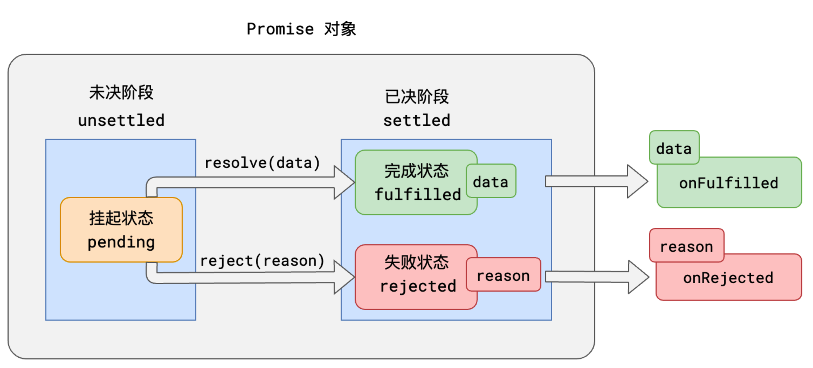

# 异步处理

## 事件循环 eventLoop

MutationObserver 用于监听某个 DOM 对象的变化 当执行栈清空时，JS 引擎首先会将微任务中的所有任务依次执行结束，如果没有微任务，则执行宏任务。

## 异步处理的通用模型

事情总是从 未决阶段 逐步发展到 已决阶段的。并且，未决阶段拥有控制何时通向已决阶段的能力。

**始终记住，无论是阶段，还是状态，是不可逆的！**

## Promise的基本使用（从头再看看）

thenable和catchable函数是异步的，就算是立即执行，也会加入到事件队列中等待执行，并且，加入的队列是微队列

- **Promise并没有消除回调，只是让回调变得可控**

​	

duration 持续时间

Interval 时间间隔

dfshjfhs