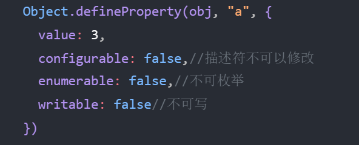

# 异步处理

## 事件循环 eventLoop

MutationObserver 用于监听某个 DOM 对象的变化 当执行栈清空时，JS 引擎首先会将微任务中的所有任务依次执行结束，如果没有微任务，则执行宏任务。

## 异步处理的通用模型

事情总是从 未决阶段 逐步发展到 已决阶段的。并且，未决阶段拥有控制何时通向已决阶段的能力。

**始终记住，无论是阶段，还是状态，是不可逆的！**


## Promise的基本使用（从头再看看）

thenable和catchable函数是异步的，就算是立即执行，也会加入到事件队列中等待执行，并且，加入的队列是微队列

- **Promise并没有消除回调，只是让回调变得可控**

​	

duration 持续时间

Interval 时间间隔

​	

[《catch，能不能模拟then效果》这个问题等promise复习了之后一起看](https://sunny-117.github.io/blog/js/%E5%BC%82%E6%AD%A5%E5%A4%84%E7%90%86.html#catch-%E8%83%BD%E4%B8%8D%E8%83%BD%E6%A8%A1%E6%8B%9Fthen%E6%95%88%E6%9E%9C)

​	

# 代理与反射

如果需要为某个对象添加属性时 或 修改属性时， 配置其属性描述符，可以使用下面的代码: Object.defineProperty(对象, 属性名, 描述符);

```js
const obj = {
  a: 1,
  b: 2
}
Object.defineProperty(obj, "a", {
  value: 3,
  configurable: false,//描述符不可以修改
  enumerable: false,//不可枚举
  writable: false//不可写
})
```

​	

属性描述符中，如果配置了 get 和 set 中的任何一个，则该属性，不再是一个普通属性，而变成了存取器属性。

get 和 set配置均为函数，如果一个属性是存取器属性，则读取该属性时，会运行get方法，将get方法得到的返回值作为属性值；如果给该属性赋值，则会运行set方法。 属性已经不再内存里面了，而是get和set

存取器属性最大的意义，在于可以控制属性的读取和赋值



​	

> Object.seal(this); 查一下含义

​	

## Reflect[#](https://sunny-117.github.io/blog/js/代理与反射.html#reflect是什么)

### Reflect是什么？

Reflect是一个内置的JS对象，它提供了一系列方法，可以让开发者通过调用这些方法，访问一些JS底层功能 由于它类似于其他语言的**反射**，因此取名为Reflect

有一个重要的理念，在ES5就被提出：减少魔法、让代码更加纯粹，这种理念很大程度上是受到函数式编程的影响

ES6进一步贯彻了这种理念，它认为，对属性内存的控制、原型链的修改、函数的调用等等，这些都属于底层实现，属于一种魔法，因此，需要将它们提取出来，形成一个正常的API，并高度聚合到某个对象中，于是，就造就了Reflect对象

因此，你可以看到Reflect对象中有很多的API都可以使用过去的某种语法或其他API实现。

- Reflect.defineProperty(target, propertyKey, attributes)：类似于Object.defineProperty，不同的是如果配置出现问题，返回false而不是报错

​	

## 应用

### 观察者模式[#](https://sunny-117.github.io/blog/js/代理与反射.html#观察者模式)

有一个对象，是观察者，它用于观察另外一个对象的属性值变化，当属性值变化后会收到一个通知，可能会做一些事。

​	

# 迭代器和生成器

## 迭代模式

一种设计模式，用于统一迭代过程，并规范了迭代器规格：

- 迭代器应该具有得到下一个数据的能力
- 迭代器应该具有判断是否还有后续数据的能力

